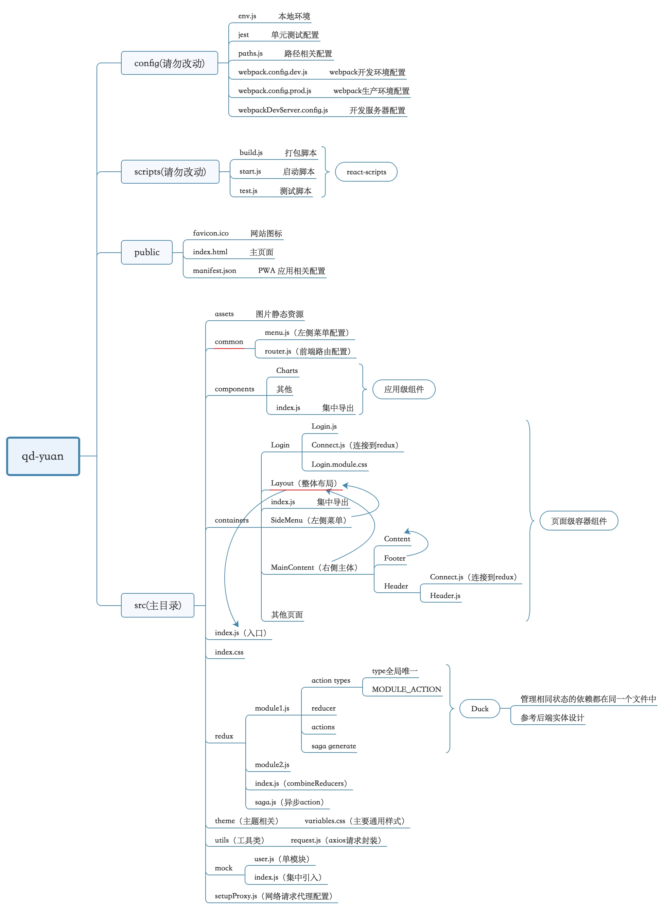

### react-webpack
- 基于create-react-app
- 集成了路由组件react-router-dom V4版本
- 集成了第三方UI组件库antd https://ant.design
- 集成了css-modules、postcss-preset-env stage0
- 集成了redux状态管理库及redux-saga异步处理（并进行了封装）
- 集成了connected-react-router将router放入redux中
- 集成了react-loadable按需加载
- 封装了axios网络请求
### 主要模块版本
- "connected-react-router": "^5.0.0",
- "react": "^16.6.0"
- "react-loadable": "^5.5.0",
- "react-redux": "^5.1.0",
- "react-router-dom": "^4.3.1",
- "redux": "^4.0.1",
- "webpack": "4.19.1"
### 运行项目
1. `git clone https://github.com/fromatlantis/react-webpack.git`
2. `cd react-webpack`
3. `yarn isntall`
4. `yarn start`
### 目录结构

### 开发注意事项
- js/jsx 
    - 使用es6规范
    - 使用fetch处理网络请求
    - 箭头函数的理解和使用
    - await/async的理解是使用
- css 
    - 启用模块化：.module.css后缀
    - sass预编译：.sass后缀
    - 布局：使用flex弹性布局
    - css-next新特性的使用
- redux
  - 将相关联的reducer、action types和action写到一个文件里。本质上是以应用的状态作为模块的划分依据，而不是以界面功能作为划分模块的依据。这样，管理相同状态的依赖都在同一个文件中，不管哪个容器组件需要使用这部分状态，只需要在这个组件中引入这个状态对应的文件即可
  - saga中间件主要解决产生副作用的action(比如异步)，每个异步方法需要在saga.js里面配置
### gitlab版本管理
采用阿里的AoneFlow模式
1. 从主干创建特性分支 
    - 以feature/前缀命名
    - 可以是一个人完成，或是多个人协作完成
    - 所有修改不允许直接提交到主干
2. 从主干拉去分支，合并特性分支，形成发布分支 ``
    - 以release/前缀命名
    - release/test对应部署测试环境
    - release/prod对应线上正式环境
3. 发布后合并相应的发布分支到主干，在主干添加标签，同时删除该发布分支关联的特性分支
    - 主干分支上的最新版本始终与线上版本一致
    - 回溯历史版本，只需在主干分支上找到相应的版本标签即可
4. 上线后的Hotfix
    - 在这个发布分支上直接修改
    - 修改历史版本Bug：在主干分支找到版本标签位置，创建Hotfix分支
5. 其他
    - 用于线上发布的代码，不可以使用未正式发布版本的依赖包
### git常用命令
- 创建并切换分支 `git checkout -b feature/settings`
- 合并分支到当前分支下 `git merge dev`
    - no-ff参数，表示禁用Fast forward，删除分支后，不会丢掉分支信息 `git merge --no-ff -m "merge with no-ff" dev`
- 推送分支 `git push origin dev`
    - master分支是主分支，因此要时刻与远程同步
    - feature分支是否推到远程，取决于你是否和你的小伙伴合作在上面开发
    - bug分支只用于在本地修复bug，就没必要推到远程了，除非老板要看看你每周到底修复了几个bug
- 远程抓取分支（先执行git pull） `git checkout -b dev origin/dev`
    - 获取最新`git pull origin/dev`
- 指定本地dev分支与远程origin/dev分支的链接 `git branch --set-upstream-to=origin/dev dev`
- 删除分支(不能在当前分支删除当前分支)
    - 远程 `git push origin :feature/common`
    - 本地 `git branch -d feature/common`
- 创建Tag标签
    - 新建标签 `git tag -a v0.3.0 -m "new tag"`
    - 查看标签 `git show v0.3.0`
    - 推送到远程 `git push origin v0.3.0`
    - 删除本地tag `git tag -d v0.3.0`
    - 删除远程tag `git push origin --delete v0.3.0`